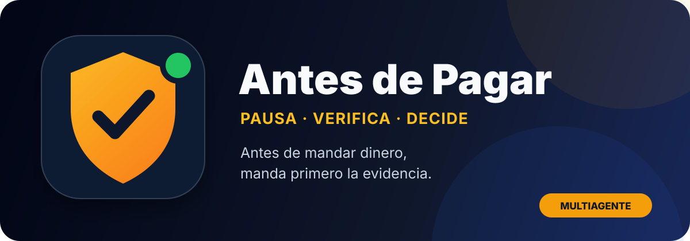

<p align="center">
  
</p>

<p align="center">
  <a href="https://github.com/hose909012-coder/antes-de-pagar/actions/workflows/validate.yml"></a>
  
  
  <a href="LICENSE"></a>
</p>

<p align="center"><strong>Antes de mandar dinero, manda primero la evidencia.</strong></p>

Antes de Pagar es una skill abierta y multiagente que analiza posibles estafas, phishing, suplantaciones, ofertas engañosas y solicitudes de pago. Trabaja con capturas, mensajes, correos, enlaces, facturas, ofertas de trabajo y ventas en línea.

No acusa automáticamente a personas ni promete que una operación sea “100 % segura”. Separa hechos, señales e incertidumbre y propone una verificación independiente.

## Por qué es esencial

Las decisiones urgentes y costosas suelen ocurrir justo cuando hay menos tiempo para comprobar. Esta skill introduce una pausa repetible antes de enviar dinero, credenciales o documentos y convierte evidencia desordenada en una decisión accionable.

| Entrada | La skill detecta | Resultado |
|---|---|---|
| Captura o mensaje | Urgencia, presión, suplantación | Nivel de riesgo y señales |
| Enlace o dominio | Inconsistencias y afirmaciones verificables | Fuentes oficiales y pasos seguros |
| Oferta o factura | Métodos de pago, identidad y condiciones | Qué no hacer y cómo comprobar |
| Pago ya realizado | Exposición y acciones pendientes | Plan inmediato de contención |

## Compatible por diseño

El núcleo vive en [`skills/antes-de-pagar/SKILL.md`](skills/antes-de-pagar/SKILL.md) y sigue el formato abierto Agent Skills. Los adaptadores sólo enrutan al mismo flujo; así no existen seis versiones contradictorias de las reglas de seguridad.

| Agente o entorno | Integración incluida |
|---|---|
| Codex / ChatGPT Work | Agent Plugin + `openai.yaml` |
| Claude Code | `CLAUDE.md` + skill estándar |
| Gemini CLI | `GEMINI.md` |
| GitHub Copilot | `.github/copilot-instructions.md` |
| Cursor | `.cursor/rules/antes-de-pagar.mdc` |
| OpenCode y lectores de AGENTS.md | `AGENTS.md` |
| Otros agentes | [`adapters/UNIVERSAL.md`](adapters/UNIVERSAL.md) |

Consulta [COMPATIBILITY.md](COMPATIBILITY.md) para instalación, alcance y límites de cada integración.

## Prueba rápida

> “Antes de pagar esta factura, analiza la evidencia. Separa hechos de suposiciones, dime las tres señales principales y cómo verificar al emisor por un canal independiente.”

La respuesta siempre prioriza:

1. **Conclusión:** `Riesgo alto`, `Precaución`, `Pocas señales de riesgo` o `No hay datos suficientes`.
2. **Por qué:** señales observables, sin inventar certeza.
3. **Acción inmediata:** qué no hacer y cómo verificar.
4. **Contención:** si el usuario ya pagó o compartió datos.

## Instalación en Codex

Requiere una versión compatible con Agent Plugins.

```bash
codex plugin marketplace add hose909012-coder/antes-de-pagar --ref main
codex plugin add antes-de-pagar@antes-de-pagar
```

Inicia un chat nuevo e invoca `$antes-de-pagar`. Para actualizar:

```bash
codex plugin marketplace upgrade antes-de-pagar
codex plugin add antes-de-pagar@antes-de-pagar
```

Para otros agentes, clona el repositorio y sigue la fila correspondiente en [COMPATIBILITY.md](COMPATIBILITY.md).

## Uso seguro

- Censura números de cuenta, direcciones, documentos, contraseñas y códigos antes de subir capturas.
- Nunca compartas contraseñas, códigos de un solo uso, frases semilla ni claves privadas.
- No abras enlaces sospechosos para “comprobarlos”; comparte el texto o una captura.
- Una conclusión con pocas señales no sustituye la verificación con el banco, plataforma o empresa por un canal oficial.

## Desarrollo y validación

```bash
python3 scripts/validate_repo.py
```

La validación comprueba manifiestos, versión, recursos visuales, adaptadores multiagente, referencias canónicas y marcadores incompletos. Consulta [CONTRIBUTING.md](CONTRIBUTING.md) para contribuir y [SECURITY.md](SECURITY.md) para reportar fallos sin publicar datos personales.

## Privacidad y licencia

No incluye servidor, base de datos ni telemetría propios. El tratamiento de mensajes y archivos depende del agente anfitrión y de las herramientas habilitadas. Consulta [PRIVACY.md](PRIVACY.md), [TERMS.md](TERMS.md) y la licencia [MIT](LICENSE).
